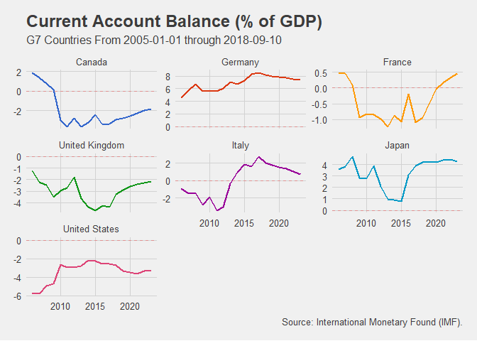

<!-- README.md is generated from README.Rmd. Please edit that file -->
FromQuandl
==========

The goal of FromQuandl is to easy the search, download and data preprocessing steps that often happen when using the `Quandl` package in R.

Currently supports functions for IMF and World Bank datasets.

Installation
------------

You can install FromQuandl from github with:

``` r
# install.packages("devtools")
devtools::install_github("Reckziegel/FromQuandl")
```

Examples
--------

Suppose you would like to download the Current Account Balance (as % of GDP) for all countries of a specific region or with similar economic characteristics, like the G7. Use the `imf_search()` function to discover the Current Account code in `Quandl`.

``` r
library(FromQuandl)
imf_search('account')
#> # A tibble: 2 x 2
#>   imf_name                              imf_code 
#>   <chr>                                 <chr>    
#> 1 current account balance, % of gdp     BCA_NGDPD
#> 2 current account balance, usd billions BCA
```

Next use `fq_imf()` to download and plot the data.

``` r
library(FromQuandl)
library(ggplot2)
library(dplyr)
library(ggthemes)

ca <- fq_imf(countries = 'g7', indicators = 'BCA_NGDPD', start_date = '2005-01-01')
ca
#> # A tibble: 126 x 4
#>    date       country indicator                          value
#>    <date>     <fct>   <fct>                              <dbl>
#>  1 2005-12-31 Canada  Current Account Balance, % of GDP  1.85 
#>  2 2006-12-31 Canada  Current Account Balance, % of GDP  1.37 
#>  3 2007-12-31 Canada  Current Account Balance, % of GDP  0.758
#>  4 2008-12-31 Canada  Current Account Balance, % of GDP  0.099
#>  5 2009-12-31 Canada  Current Account Balance, % of GDP -2.95 
#>  6 2010-12-31 Canada  Current Account Balance, % of GDP -3.61 
#>  7 2011-12-31 Canada  Current Account Balance, % of GDP -2.77 
#>  8 2012-12-31 Canada  Current Account Balance, % of GDP -3.60 
#>  9 2013-12-31 Canada  Current Account Balance, % of GDP -3.22 
#> 10 2014-12-31 Canada  Current Account Balance, % of GDP -2.43 
#> # ... with 116 more rows

ca %>%
  ggplot(aes(x = date, y = value, color = country)) + 
  geom_line(size = 1, show.legend = FALSE) + 
  geom_hline(aes(yintercept = 0), color = 'red', linetype = 'dashed', alpha = 0.3) + 
  facet_wrap(~country, scale = "free_y") +
  labs(title    = "Current Account Balance (% of GDP)",
       subtitle = "G7 Countries From 2005-01-01 through 2018-09-10",
       caption  = "Source: International Monetary Found (IMF).") +
  theme_fivethirtyeight() +
  scale_color_gdocs()
```



The result is a `tibble` that it's ready to be used in `ggplot2`.

There is no need to restrict the download to only one indicator. The `indicators` argument supports lists and vectors of strings as well, but be aware that may be safe using `Quandl.api_key()` if you want to access several time series at once.

As a second example imagine that you want to downalod the rate of change in poverty statistics from the World Bank for all countries in the Commonwealth of Independent States. Simply run

``` r
#library(FromQuandl)

# get poverty codes
poverty_data <- wb_search('poverty')
#> # A tibble: 16 x 2
#>    indicator                                                    code      
#>    <chr>                                                        <chr>     
#>  1 poverty gap at $1.25 a day (ppp) (%)                         SI_POV_GA~
#>  2 poverty gap at $2 a day (ppp) (%)                            SI_POV_GA~
#>  3 poverty gap at national poverty line (%)                     SI_POV_NA~
#>  4 poverty gap at rural poverty line (%)                        SI_POV_RU~
#>  5 poverty gap at urban poverty line (%)                        SI_POV_UR~
#>  6 poverty headcount ratio at $1.25 a day (ppp) (% of populati~ SI_POV_DD~
#>  7 poverty headcount ratio at $2 a day (ppp) (% of population)  SI_POV_2D~
#>  8 poverty headcount ratio at national poverty line (% of popu~ SI_POV_NA~
#>  9 poverty headcount ratio at rural poverty line (% of rural p~ SI_POV_RU~
#> 10 poverty headcount ratio at urban poverty line (% of urban p~ SI_POV_UR~
#> 11 poverty gap at $2.5 a day (ppp) (%)                          SI_POV_GA~
#> 12 poverty gap at $4 a day (ppp) (%)                            SI_POV_GA~
#> 13 poverty gap at $5 a day (ppp) (%)                            SI_POV_GA~
#> 14 poverty headcount ratio at $2.5 a day (ppp) (% of populatio~ SI_POV_25~
#> 15 poverty headcount ratio at $4 a day (ppp) (% of population)  SI_POV_4D~
#> 16 poverty headcount ratio at $5 a day (ppp) (% of population)  SI_POV_5D~

# download data
fq_wb(countries = 'cis', indicators = poverty_data$code, transform = 'rdiff') 
#> # A tibble: 257 x 4
#>    date       country indicator                              value
#>    <date>     <fct>   <fct>                                  <dbl>
#>  1 1998-12-31 Armenia Poverty gap at $1.25 a day (PPP) (%) -0.216 
#>  2 1999-12-31 Armenia Poverty gap at $1.25 a day (PPP) (%)  0.0847
#>  3 2001-12-31 Armenia Poverty gap at $1.25 a day (PPP) (%)  0.0732
#>  4 2002-12-31 Armenia Poverty gap at $1.25 a day (PPP) (%) -0.273 
#>  5 2003-12-31 Armenia Poverty gap at $1.25 a day (PPP) (%) -0.375 
#>  6 2004-12-31 Armenia Poverty gap at $1.25 a day (PPP) (%) -0.1   
#>  7 2005-12-31 Armenia Poverty gap at $1.25 a day (PPP) (%) -0.5   
#>  8 2006-12-31 Armenia Poverty gap at $1.25 a day (PPP) (%) -0.333 
#>  9 2007-12-31 Armenia Poverty gap at $1.25 a day (PPP) (%) -0.167 
#> 10 2008-12-31 Armenia Poverty gap at $1.25 a day (PPP) (%) -0.4   
#> # ... with 247 more rows
```

The data is tidy and ready to be used with the `%>%` operatior.

Additional information about the `fq_imf()`and `fq_wb()` can be found at the package documenation.

Future Developments
-------------------

This is a work in progress. Very soon the package will have a function to download the components of the most important stock indexes in US. Suggestions are welcome, :-).
