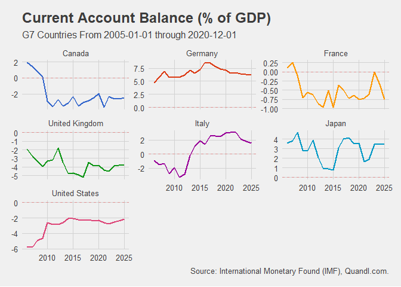

<!-- README.md is generated from README.Rmd. Please edit that file -->

# FromQuandl

<!-- badges: start -->

[](https://travis-ci.com/Reckziegel/FromQuandl)
[](https://ci.appveyor.com/project/Reckziegel/FromQuandl)
[](https://github.com/Reckziegel/FromQuandl/actions)
[](https://codecov.io/gh/Reckziegel/FromQuandl?branch=master)
<!-- badges: end -->

The goal of `FromQuandl` is to easy the search, download and data
preprocessing steps that often happens when using the `Quandl` package
in R.

Currently supports functions for `IMF`, `World Bank` and `Yale
Department of Economics` datasets.

## Installation

You can install FromQuandl from github with:

``` r
# install.packages("devtools")
devtools::install_github("Reckziegel/FromQuandl")
```

## Examples

Suppose you would like to download the Current Account Balance (as % of
GDP) for all countries of a specific region or with similar economic
characteristics, like the G7. Use the `fq_imf_search()` function to
discover the Current Account code in `Quandl`.

``` r
fq_imf_search('account')
#> # A tibble: 2 x 2
#>   imf_name                              imf_code 
#>   <chr>                                 <chr>    
#> 1 Current Account Balance, % of GDP     BCA_NGDPD
#> 2 Current Account Balance, USD Billions BCA
```

Next use `fq_imf()` to download and plot the data.

``` r

ca <- fq_imf(countries = 'g7', indicators = 'BCA_NGDPD', start_date = '2005-01-01')
ca
#> # A tibble: 140 x 4
#>    date       country indicator                          value
#>    <date>     <fct>   <fct>                              <dbl>
#>  1 2005-12-31 Canada  Current Account Balance, % of GDP  1.93 
#>  2 2006-12-31 Canada  Current Account Balance, % of GDP  1.44 
#>  3 2007-12-31 Canada  Current Account Balance, % of GDP  0.823
#>  4 2008-12-31 Canada  Current Account Balance, % of GDP  0.147
#>  5 2009-12-31 Canada  Current Account Balance, % of GDP -2.91 
#>  6 2010-12-31 Canada  Current Account Balance, % of GDP -3.56 
#>  7 2011-12-31 Canada  Current Account Balance, % of GDP -2.71 
#>  8 2012-12-31 Canada  Current Account Balance, % of GDP -3.53 
#>  9 2013-12-31 Canada  Current Account Balance, % of GDP -3.14 
#> 10 2014-12-31 Canada  Current Account Balance, % of GDP -2.32 
#> # ... with 130 more rows

ca %>%
  ggplot(aes(x = date, y = value, color = country)) + 
  geom_line(size = 1, show.legend = FALSE) + 
  geom_hline(aes(yintercept = 0), color = 'red', linetype = 'dashed', alpha = 0.3) +
  facet_wrap(~country, scale = "free_y") +
  labs(title    = "Current Account Balance (% of GDP)",
       subtitle = "G7 Countries From 2005-01-01 through 2020-12-01",
       caption  = "Source: International Monetary Found (IMF), Quandl.com.") +
  theme_fivethirtyeight() +
  scale_color_gdocs()
```

<!-- -->

The result is a `tibble` that it’s ready to be used in `ggplot2`.

There is no need to restrict the download to only one indicator. The
`indicators` argument supports lists and vectors of strings as well, but
be aware that may be safe using `Quandl.api_key()` if you want to access
several time series at once.

As a second example imagine that you want to download the rate of change
in poverty statistics from the World Bank for all countries in the
Commonwealth of Independent States. Simply run

``` r
#library(FromQuandl)

# get poverty codes
poverty_data <- fq_wb_search('poverty')

# download data
fq_wb(countries = 'cis', indicators = poverty_data$code, transform = 'rdiff') 
#> # A tibble: 1,616 x 4
#>    date       country indicator                              value
#>    <date>     <fct>   <fct>                                  <dbl>
#>  1 1998-12-31 Armenia Poverty gap at $1.25 a day (PPP) (%) -0.216 
#>  2 1999-12-31 Armenia Poverty gap at $1.25 a day (PPP) (%)  0.0847
#>  3 2001-12-31 Armenia Poverty gap at $1.25 a day (PPP) (%)  0.0732
#>  4 2002-12-31 Armenia Poverty gap at $1.25 a day (PPP) (%) -0.273 
#>  5 2003-12-31 Armenia Poverty gap at $1.25 a day (PPP) (%) -0.375 
#>  6 2004-12-31 Armenia Poverty gap at $1.25 a day (PPP) (%) -0.1   
#>  7 2005-12-31 Armenia Poverty gap at $1.25 a day (PPP) (%) -0.5   
#>  8 2006-12-31 Armenia Poverty gap at $1.25 a day (PPP) (%) -0.333 
#>  9 2007-12-31 Armenia Poverty gap at $1.25 a day (PPP) (%) -0.167 
#> 10 2008-12-31 Armenia Poverty gap at $1.25 a day (PPP) (%) -0.4   
#> # ... with 1,606 more rows
```

The data is tidy and ready to be used with the `%>%` operator.

Additional information about the `fq_imf()`, `fq_wb()` and `fq_yale()`
can be found at the package documentation.
